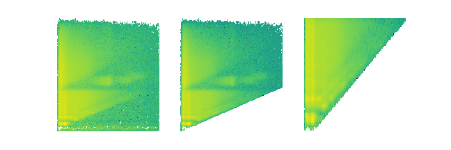

Welcome to OMpy's documentation!
================================

|Travis| |Binder| |Code Climate maintainability| |DOI| |DOI-article|

This is ``ompy``, the Oslo method in python. It contains all the
functionality needed to go from a raw coincidence matrix, via unfolding
and the first-generation method, to fitting a level density and
gamma-ray strength function. It also supports uncertainty propagation by
Monte Carlo. If you want to try the package before installation, you may
simply `click here`_ to launch it on Binder.

.. _click here: https://mybinder.org/v2/gh/oslocyclotronlab/ompy/master?filepath=ompy%2Fnotebooks%2Fgetting_started.ipynb

.. toctree::
   :maxdepth: 2
   :caption: Contents:

   install
   getting_started
   concepts
   API/index
   cite
   LICENSE

Indices and tables
==================

* :ref:`genindex`
* :ref:`search`
.. Include this to generate the api files to be included under API/index
.. include:: api

.. |Travis| image:: https://img.shields.io/travis/oslocyclotronlab/ompy?style=flat-square
.. |Binder| image:: https://mybinder.org/badge_logo.svg
   :target: https://mybinder.org/v2/gh/oslocyclotronlab/ompy/master?filepath=ompy%2Fnotebooks%2Fgetting_started.ipynb
.. |Code Climate maintainability| image:: https://img.shields.io/codeclimate/maintainability/oslocyclotronlab/ompy?style=flat-square
.. |DOI| image:: https://zenodo.org/badge/141709973.svg
   :target: https://zenodo.org/badge/latestdoi/141709973
.. |DOI-article| image:: https://img.shields.io/badge/DOI-10.1016/j.cpc.2020.107795-yellowgreen
   :target: https://doi.org/10.1016/j.cpc.2020.107795
